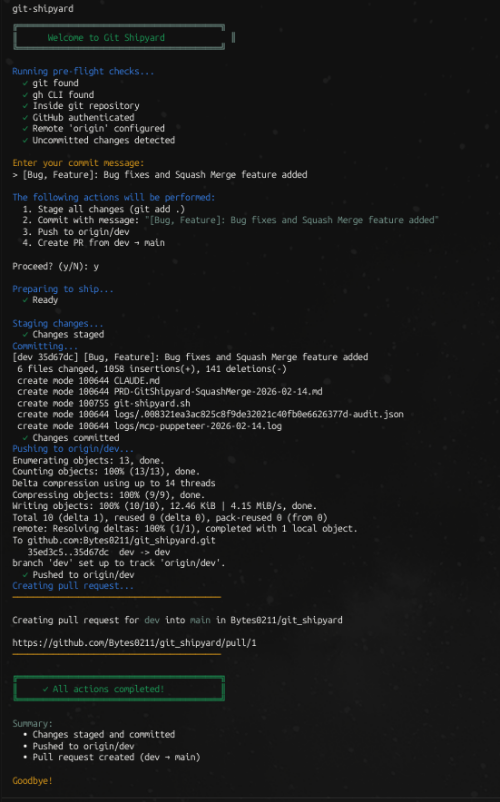

# Git Shipyard

**Git Shipyard** is an interactive Bash utility that streamlines your Git workflow by automating the common sequence of staging, committing, pushing, and creating GitHub pull requests—all in one command.

## Screen Shot



## Features

- 🚢 **One-command workflow**: Stage, commit, push, and create PR in a single interactive session
- 🎯 **Smart mode detection**: Automatically adapts to your repository state
  - Full workflow when you have uncommitted changes
  - PR-only mode when changes are already committed
- ✅ **Pre-flight checks**: Validates environment before execution (git, gh CLI, authentication, remote)
- 🎨 **Beautiful CLI interface**: Color-coded output with progress indicators
- 🛡️ **Safe by default**: Confirmation prompts before executing operations
- ⚙️ **Configurable branches**: Override default base and head branches via flags

## Prerequisites

- **git**: Version control system
- **gh**: [GitHub CLI](https://cli.github.com/) for PR creation
- **bash**: 4.0 or higher
- GitHub authentication configured (`gh auth login`)

## Installation

### Quick Install

```bash
# Clone or download the script
curl -o git-shipyard.sh https://raw.githubusercontent.com/YOUR_USERNAME/git_shipyard/main/git-shipyard.sh

# Make it executable
chmod +x git-shipyard.sh

# Optional: Move to PATH for global access
sudo mv git-shipyard.sh /usr/local/bin/git-shipyard
```

### As Git Subcommand

Once `git-shipyard` is in your PATH, you can invoke it as a git subcommand:

```bash
git shipyard
```

## Usage

### Basic Usage

Run the script from within any git repository:

```bash
./git-shipyard.sh
```

The script will:
1. Detect if you have uncommitted changes or unpushed commits
2. Run pre-flight checks (git, gh, authentication, remote)
3. Prompt for commit message (if needed)
4. Show you what actions will be performed
5. Ask for confirmation before proceeding
6. Execute the workflow and create a PR

### Custom Branches

By default, Git Shipyard creates PRs from `dev` to `main`. You can override these:

```bash
./git-shipyard.sh --base production --head feature-branch
```

### Execution Modes

**Full Mode** (uncommitted changes exist):
```
Stage → Commit → Push → Create PR
```

**PR-only Mode** (changes already committed):
```
Push (if needed) → Create PR
```

### Help

```bash
./git-shipyard.sh --help
```

## Examples

### Scenario 1: You have uncommitted changes

```bash
$ ./git-shipyard.sh

╔════════════════════════════════════════╗
║      Welcome to Git Shipyard           ║
╚════════════════════════════════════════╝

Running pre-flight checks...
  ✓ git found
  ✓ gh CLI found
  ✓ Inside git repository
  ✓ GitHub authenticated
  ✓ Remote 'origin' configured
  ✓ Uncommitted changes detected

Enter your commit message:
> Add new feature for user authentication

The following actions will be performed:
  1. Stage all changes (git add .)
  2. Commit with message: "Add new feature for user authentication"
  3. Push to origin/dev
  4. Create PR from dev → main

Proceed? (y/N): y
```

### Scenario 2: Changes already committed

```bash
$ ./git-shipyard.sh

Running pre-flight checks...
  ✓ git found
  ✓ gh CLI found
  ✓ Inside git repository
  ✓ GitHub authenticated
  ✓ Remote 'origin' configured
  ✓ Commits ahead of main (already committed)

The following actions will be performed:
  1. Push to origin/dev (if needed)
  2. Create PR from dev → main

Proceed? (y/N): y
```

### Scenario 3: Custom branches

```bash
$ ./git-shipyard.sh --base production --head hotfix-auth

# Creates PR from hotfix-auth → production
```

## Configuration

### Default Branches

Edit lines 10-11 in `git-shipyard.sh` to change default branches:

```bash
BASE_BRANCH="main"    # Target branch for PRs
HEAD_BRANCH="dev"     # Source branch for PRs
```

### Per-Repository Configuration

You can override defaults per invocation using flags, or consider reading from git config for permanent per-repository settings.

## How It Works

1. **Pre-flight Checks**: Validates that all required tools are installed and configured
2. **State Detection**: Determines execution mode by checking:
   - `git diff` for uncommitted changes
   - `git rev-list` for commits ahead of base branch
3. **User Interaction**: Collects commit message (if needed) and confirmation
4. **Git Operations**: Executes git commands sequentially with error handling
5. **PR Creation**: Uses `gh pr create --fill` to auto-populate PR details from commit messages

## Error Handling

- All operations are validated before execution
- Clear error messages guide you if something goes wrong
- Special handling for "PR already exists" scenario—opens existing PR in browser
- Global error trap catches unexpected failures

## Limitations

- Currently supports GitHub only (via `gh` CLI)
- Uses `origin` remote by default
- Stages all changes (`git add .`) rather than selective staging

## Troubleshooting

### "Not authenticated with GitHub"

Run GitHub CLI authentication:
```bash
gh auth login
```

### "No 'origin' remote found"

Add a remote repository:
```bash
git remote add origin https://github.com/username/repo.git
```

### "PR already exists for this branch"

The script will automatically open the existing PR in your browser instead of failing.

## Contributing

Contributions welcome! This is a single-file utility, so modifications are straightforward:

1. Fork the repository
2. Make your changes to `git-shipyard.sh`
3. Test both execution modes
4. Submit a pull request

## License

MIT License - feel free to use and modify as needed.

## Author

Created to streamline the repetitive Git workflow of staging, committing, pushing, and PR creation.
