# Git Shipyard — Process Flow

```mermaid
flowchart TD
    Start([Start]) --> ParseArgs[Parse CLI Arguments<br/><code>--base, --head, --draft, --help</code>]

    ParseArgs --> IsHelp{--help?}
    IsHelp -->|Yes| PrintUsage[Print usage info] --> Exit0([Exit 0])
    IsHelp -->|No| UnknownArg{Unknown arg?}
    UnknownArg -->|Yes| ErrArg([Error: Unknown option — Exit 1])
    UnknownArg -->|No| Preflight

    subgraph Preflight [Pre-flight Checks]
        direction TB
        ChkGit[Check <code>git</code> installed] --> ChkGH[Check <code>gh</code> CLI installed]
        ChkGH --> ChkJQ[Check <code>jq</code> installed]
        ChkJQ --> ChkRepo[Check inside git repository]
        ChkRepo --> ChkDetached[Check not in detached HEAD]
        ChkDetached --> ChkBase[Check not on base branch]
        ChkBase --> ChkAuth[Check GitHub authentication]
        ChkAuth --> ChkRemote[Check <code>origin</code> remote exists]
    end

    Preflight -->|Any check fails| ErrPreflight([Error — Exit 1])
    Preflight --> DetectMode{Detect Workflow Mode}

    DetectMode -->|Uncommitted changes exist| FullMode
    DetectMode -->|No uncommitted changes,<br/>commits ahead of base| PROnlyMode
    DetectMode -->|No changes,<br/>no commits ahead| ErrNoChanges([Error: Nothing to do — Exit 1])

    subgraph FullMode [Full Mode: Stage → Commit → Push → PR]
        direction TB
        GetMsg[Prompt for Commit Message]
        GetMsg --> MsgChoice{Single-line or<br/>Editor?}
        MsgChoice -->|Single-line| ReadLine[Read single line input]
        MsgChoice -->|Editor| OpenEditor[Open editor<br/><em>git core.editor / $VISUAL / $EDITOR / nano</em>]
        ReadLine --> ValidateMsg
        OpenEditor --> ValidateMsg
        ValidateMsg{Message empty?}
        ValidateMsg -->|Yes| ErrEmpty([Error: Empty message — Exit 1])
        ValidateMsg -->|No| FlushInput[Flush stdin buffer]
        FlushInput --> ShowPlan1["Show plan:<br/>1. Stage all changes<br/>2. Commit<br/>3. Push to origin/HEAD_BRANCH<br/>4. Create PR"]
    end

    subgraph PROnlyMode [PR-Only Mode: Push → PR]
        direction TB
        ShowPlan2["Show plan:<br/>1. Push to origin/HEAD_BRANCH<br/>2. Create PR"]
    end

    ShowPlan1 --> Confirm
    ShowPlan2 --> Confirm

    Confirm{User confirms?<br/><em>Proceed? y/N</em>}
    Confirm -->|No| Cancelled([Operation cancelled — Exit 0])
    Confirm -->|Yes| Spinner[Spinner: Preparing to ship...]

    Spinner --> IsFullMode{Mode?}

    IsFullMode -->|Full| StageAll["<code>git add .</code>"]
    StageAll -->|Fail| ErrStage([Error: Failed to stage — Exit 1])
    StageAll -->|OK| Commit["<code>git commit -m '...'</code>"]
    Commit -->|Fail| ErrCommit([Error: Commit failed — Exit 1])
    Commit -->|OK| LinkPR

    subgraph LinkPR [Link Commit to Existing PR — Optional]
        direction TB
        FetchPRs[Fetch open PRs via <code>gh pr list</code>]
        FetchPRs --> HasPRs{Open PRs<br/>found?}
        HasPRs -->|No| SkipLink[Skip linking]
        HasPRs -->|Yes| PickPR[User selects PR or skips]
        PickPR -->|Skip| SkipLink
        PickPR -->|Selected| AmendCommit["Amend commit with<br/><em>Part of #N</em>"]
        AmendCommit -->|Fail| SkipLink
        AmendCommit -->|OK| LinkDone[✓ Commit linked]
    end

    LinkPR --> PushFull["<code>git push -u origin HEAD_BRANCH</code>"]
    PushFull -->|Rejected / non-fast-forward| ErrPushFull([Error: Push rejected — Exit 1])
    PushFull -->|Other failure| ErrPushFull2([Error: Push failed — Exit 1])
    PushFull -->|OK| SelectIssue

    IsFullMode -->|PR-Only| PushPR["<code>git push -u origin HEAD_BRANCH</code>"]
    PushPR -->|Rejected / non-fast-forward| ErrPushPR([Error: Push rejected — Exit 1])
    PushPR -->|Up-to-date / OK| SelectIssue

    subgraph SelectIssue [Link Issue to PR — Optional]
        direction TB
        FetchIssues[Fetch open issues via <code>gh issue list</code>]
        FetchIssues --> HasIssues{Open issues<br/>found?}
        HasIssues -->|No| SkipIssue[Skip linking]
        HasIssues -->|Yes| PickIssue[User selects issue or skips]
        PickIssue -->|Skip| SkipIssue
        PickIssue -->|Selected| SetIssue["Set SELECTED_ISSUE"]
    end

    SelectIssue --> CreatePR

    subgraph CreatePR [Create Pull Request]
        direction TB
        HasIssue{Issue<br/>selected?}
        HasIssue -->|Yes| PRWithIssue["<code>gh pr create --base ... --head ...<br/>--title ... --body '...Closes #N'</code><br/><em>+ --draft if flag set</em>"]
        HasIssue -->|No| PRFill["<code>gh pr create --base ... --head ... --fill</code><br/><em>+ --draft if flag set</em>"]
        PRWithIssue --> PRResult
        PRFill --> PRResult
        PRResult{PR created?}
        PRResult -->|Yes| PRDone[✓ PR created]
        PRResult -->|No| CheckExisting{PR already<br/>exists?}
        CheckExisting -->|Yes| OpenExisting["Open existing PR in browser<br/><code>gh pr view --web</code>"]
        CheckExisting -->|No| ErrPR([Error: Failed to create PR — Exit 1])
    end

    PRDone --> Success
    OpenExisting --> Success

    Success(["✓ All actions completed!<br/>Print summary — Exit 0"])

    %% Styling
    classDef errorNode fill:#f8d7da,stroke:#dc3545,color:#721c24
    classDef successNode fill:#d4edda,stroke:#28a745,color:#155724
    classDef decisionNode fill:#fff3cd,stroke:#ffc107,color:#856404

    class ErrArg,ErrPreflight,ErrNoChanges,ErrEmpty,ErrStage,ErrCommit,ErrPushFull,ErrPushFull2,ErrPushPR,ErrPR errorNode
    class Success,Exit0,PRDone,LinkDone successNode
    class IsHelp,UnknownArg,DetectMode,MsgChoice,ValidateMsg,Confirm,IsFullMode,HasPRs,HasIssues,HasIssue,PRResult,CheckExisting decisionNode
```

## Mode Detection

| Condition | Mode | Steps |
|---|---|---|
| Uncommitted changes exist | **Full** | Stage → Commit → (Link to PR) → Push → (Link Issue) → Create PR |
| No uncommitted changes, commits ahead of base | **PR-Only** | Push (if needed) → (Link Issue) → Create PR |
| No changes and no commits ahead | **Error** | Exit with error |

## Pre-flight Checks

1. `git` is installed
2. `gh` CLI is installed
3. `jq` is installed
4. Inside a git repository
5. Not in detached HEAD state
6. Not on the base branch (e.g., `main`)
7. Authenticated with GitHub (`gh auth status`)
8. Remote `origin` is configured

## CLI Options

| Flag | Description | Default |
|---|---|---|
| `--base <branch>` | Base branch for the PR | `main` |
| `--head <branch>` | Head branch for the PR | `dev` |
| `--draft` | Create the PR as a draft | `false` |
| `--help`, `-h` | Print usage and exit | — |