# Git Shipyard — Process Flow

```mermaid
flowchart TD
    Start([Start]) --> ParseArgs[Parse CLI Arguments<br/><code>--base, --head, --draft, --help</code>]

    ParseArgs --> IsHelp{--help?}
    IsHelp -->|Yes| PrintUsage[Print usage info] --> Exit0([Exit 0])
    IsHelp -->|No| UnknownArg{Unknown arg?}
    UnknownArg -->|Yes| ErrArg([Error: Unknown option — Exit 1])
    UnknownArg -->|No| IssuePrompt

    subgraph IssuePrompt [Standalone Issue Creation — Optional]
        direction TB
        AskIssue["Create a GitHub Issue? (y/N)"]
        AskIssue -->|No| SkipIssuePrompt[Continue to pre-flight]
        AskIssue -->|Yes| CollectTitle[Enter issue title]
        CollectTitle --> TitleEmpty{Title empty?}
        TitleEmpty -->|Yes| SkipIssuePrompt
        TitleEmpty -->|No| CollectOverview["Enter overview<br/><em>single-line or editor</em>"]
        CollectOverview --> SelectType["Select issue type<br/><em>enhancement / bug / feature / docs / refactor</em>"]
        SelectType --> GHIssueCreate["<code>gh issue create --label type</code>"]
        GHIssueCreate -->|Fail| SkipIssuePrompt
        GHIssueCreate -->|OK| IssueCreated[✓ Issue created]
        IssueCreated --> GoodbyeIssue([Print Goodbye — Exit 0])
    end

    SkipIssuePrompt --> Preflight

    subgraph Preflight [Pre-flight Checks]
        direction TB
        ChkGit[Check <code>git</code> installed] --> ChkGH[Check <code>gh</code> CLI installed]
        ChkGH --> ChkJQ[Check <code>jq</code> installed]
        ChkJQ --> ChkRepo[Check inside git repository]
        ChkRepo --> ChkDetached[Check not in detached HEAD]
        ChkDetached --> ChkAuth[Check GitHub authentication]
        ChkAuth --> ChkRemote[Check <code>origin</code> remote exists]
        ChkRemote --> ChkMerge[Check no merge in progress]
    end

    Preflight -->|Any check fails| ErrPreflight([Error — Exit 1])
    Preflight --> DetectMode{Detect Workflow Mode}

    DetectMode -->|Uncommitted changes exist| FullMode
    DetectMode -->|"No uncommitted changes,<br/>commits ahead of base"| PROnlyMode
    DetectMode -->|"Clean tree,<br/>no commits ahead"| PRMgmtSetup

    subgraph PRMgmtSetup [PR Management: Reset Dev Environment]
        direction TB
        SwitchBase[Switch to BASE_BRANCH]
        SwitchBase --> PullBase["<code>git pull origin BASE_BRANCH</code>"]
        PullBase --> DeleteLocalHead[Delete local HEAD_BRANCH]
        DeleteLocalHead --> CreateFreshHead["<code>git checkout -b HEAD_BRANCH</code>"]
    end

    PRMgmtSetup --> PRManagement

    subgraph PRManagement [PR Management Mode: Squash-Merge]
        direction TB
        FetchPRList["Fetch open PRs via <code>gh pr list</code>"]
        FetchPRList --> HasOpenPRs{Open PRs?}
        HasOpenPRs -->|No| NoPRsExit([Exit 0: No open PRs])
        HasOpenPRs -->|Yes| PickMergePR[User selects PR or exits]
        PickMergePR -->|Exit| CancelledPR([Operation cancelled — Exit 0])
        PickMergePR -->|Selected| ConfirmMerge{"Proceed? (y/N)"}
        ConfirmMerge -->|No| CancelledPR2([Operation cancelled — Exit 0])
        ConfirmMerge -->|Yes| SquashMerge["<code>gh pr merge --squash --delete-branch</code>"]
        SquashMerge -->|Conflict / Fail| ErrMerge([Error: Merge failed — Exit 1])
        SquashMerge -->|OK| SwitchPullBase["Switch to BASE_BRANCH, <code>git pull</code>"]
        SwitchPullBase --> DeleteLocal[Delete local head branch]
        DeleteLocal --> MergeSuccess([✓ Squash-merge complete — Exit 0])
    end

    subgraph FullMode [Full Mode: Stage → Commit → Push → Sync → PR]
        direction TB
        GetMsg[Prompt for Commit Message]
        GetMsg --> MsgChoice{Single-line or<br/>Editor?}
        MsgChoice -->|Single-line| ReadLine[Read single line input]
        MsgChoice -->|Editor| OpenEditor["Open editor<br/><em>git core.editor / $VISUAL / $EDITOR / nano</em>"]
        ReadLine --> ValidateMsg
        OpenEditor --> ValidateMsg
        ValidateMsg{Message empty?}
        ValidateMsg -->|Yes| ErrEmpty([Error: Empty message — Exit 1])
        ValidateMsg -->|No| FlushInput[Flush stdin buffer]
        FlushInput --> ShowPlan1["Show plan:<br/>1. Stage all changes<br/>2. Commit<br/>3. Push to origin/HEAD_BRANCH<br/>4. Sync with BASE_BRANCH<br/>5. Create PR"]
    end

    subgraph PROnlyMode [PR-Only Mode: Push → Sync → PR]
        direction TB
        ShowPlan2["Show plan:<br/>1. Push to origin/HEAD_BRANCH<br/>2. Sync with BASE_BRANCH<br/>3. Create PR"]
    end

    ShowPlan1 --> Confirm
    ShowPlan2 --> Confirm

    Confirm{"Proceed? (y/N)"}
    Confirm -->|No| Cancelled([Operation cancelled — Exit 0])
    Confirm -->|Yes| Spinner[Spinner: Preparing to ship...]

    Spinner --> IsFullMode{Mode?}

    IsFullMode -->|Full| StageAll["<code>git add .</code>"]
    StageAll -->|Fail| ErrStage([Error: Failed to stage — Exit 1])
    StageAll -->|OK| Commit["<code>git commit -m '...'</code>"]
    Commit -->|Fail| ErrCommit([Error: Commit failed — Exit 1])
    Commit -->|OK| LinkPR

    subgraph LinkPR [Link Commit to Existing PR — Optional]
        direction TB
        FetchPRs["Fetch open PRs via <code>gh pr list</code>"]
        FetchPRs --> HasPRs{Open PRs<br/>found?}
        HasPRs -->|No| SkipLink[Skip linking]
        HasPRs -->|Yes| PickPR[User selects PR or skips]
        PickPR -->|Skip| SkipLink
        PickPR -->|Selected| AmendCommit["Amend commit with<br/><em>Part of #N</em>"]
        AmendCommit -->|Fail| SkipLink
        AmendCommit -->|OK| LinkDone[✓ Commit linked]
    end

    LinkPR --> PushFull["<code>git push -u origin HEAD_BRANCH</code>"]
    PushFull -->|Rejected / non-fast-forward| ErrPushFull([Error: Push rejected — Exit 1])
    PushFull -->|Other failure| ErrPushFull2([Error: Push failed — Exit 1])
    PushFull -->|OK| SyncBase

    IsFullMode -->|PR-Only| PushPR["<code>git push -u origin HEAD_BRANCH</code>"]
    PushPR -->|Rejected / non-fast-forward| ErrPushPR([Error: Push rejected — Exit 1])
    PushPR -->|Up-to-date / OK| SyncBase

    subgraph SyncBase [Sync with Base Branch — Pre-PR]
        direction TB
        FetchBase["<code>git fetch origin BASE_BRANCH</code>"]
        FetchBase --> AlreadyUpToDate{Already up<br/>to date?}
        AlreadyUpToDate -->|Yes| SyncUpToDate[✓ Already in sync]
        AlreadyUpToDate -->|No| MergeBase["<code>git merge origin/BASE_BRANCH</code>"]
        MergeBase -->|Conflict| ErrConflict([Error: Merge conflict — Exit 1])
        MergeBase -->|OK| PushMerge["<code>git push origin HEAD_BRANCH</code>"]
        PushMerge -->|Fail| ErrSyncPush([Error: Failed to push merge commit — Exit 1])
        PushMerge -->|OK| SyncDone[✓ Synced with base]
    end

    SyncBase --> SelectIssue

    subgraph SelectIssue [Link Issue to PR — Optional]
        direction TB
        FetchIssues["Fetch open issues via <code>gh issue list</code>"]
        FetchIssues --> HasIssues{Open issues<br/>found?}
        HasIssues -->|No| SkipIssue[Skip linking]
        HasIssues -->|Yes| PickIssue[User selects issue or skips]
        PickIssue -->|Skip| SkipIssue
        PickIssue -->|Selected| SetIssue["Set SELECTED_ISSUE"]
    end

    SelectIssue --> CreatePR

    subgraph CreatePR [Create Pull Request]
        direction TB
        HasIssue{Issue<br/>selected?}
        HasIssue -->|Yes| PRWithIssue["<code>gh pr create --base ... --head ...<br/>--title ... --body '...Closes #N'</code><br/><em>+ --draft if flag set</em>"]
        HasIssue -->|No| PRFill["<code>gh pr create --base ... --head ... --fill</code><br/><em>+ --draft if flag set</em>"]
        PRWithIssue --> PRResult
        PRFill --> PRResult
        PRResult{PR created?}
        PRResult -->|Yes| PRDone[✓ PR created]
        PRResult -->|No| CheckExisting{PR already<br/>exists?}
        CheckExisting -->|Yes| OpenExisting["Open existing PR in browser<br/><code>gh pr view --web</code>"]
        CheckExisting -->|No| ErrPR([Error: Failed to create PR — Exit 1])
    end

    PRDone --> PostPRIssue
    OpenExisting --> PostPRIssue

    subgraph PostPRIssue [Post-PR: Create GitHub Issue — Optional]
        direction TB
        AskCreateIssue["Create a GitHub Issue? (y/N)"]
        AskCreateIssue -->|No| SkipPostIssue[Skip]
        AskCreateIssue -->|Yes| CollectIssueTitle[Enter issue title]
        CollectIssueTitle --> IssueTitleEmpty{Title empty?}
        IssueTitleEmpty -->|Yes| SkipPostIssue
        IssueTitleEmpty -->|No| CollectIssueOverview["Enter overview<br/><em>single-line or editor</em>"]
        CollectIssueOverview --> SelectIssueType["Select type<br/><em>enhancement / bug / feature / docs / refactor</em>"]
        SelectIssueType --> GHIssueCreatePost["<code>gh issue create --label type</code>"]
        GHIssueCreatePost -->|Fail| SkipPostIssue
        GHIssueCreatePost -->|OK| PostIssueNum[✓ Issue #N created]
        PostIssueNum --> LinkToExistingPR{Open PRs?}
        LinkToExistingPR -->|No| SkipPostIssue
        LinkToExistingPR -->|Yes| PickExistingPR[User selects PR or skips]
        PickExistingPR -->|Skip| SkipPostIssue
        PickExistingPR -->|Selected| AppendCloses["<code>gh pr edit #PR --body '...Closes #N'</code>"]
        AppendCloses -->|Fail| SkipPostIssue
        AppendCloses -->|OK| IssuePRLinked[✓ Issue linked to PR]
    end

    PostPRIssue --> Success

    Success(["✓ All actions completed!<br/>Print summary — Exit 0"])

    %% Styling
    classDef errorNode fill:#f8d7da,stroke:#dc3545,color:#721c24
    classDef successNode fill:#d4edda,stroke:#28a745,color:#155724
    classDef decisionNode fill:#fff3cd,stroke:#ffc107,color:#856404

    class ErrArg,ErrPreflight,ErrEmpty,ErrStage,ErrCommit,ErrPushFull,ErrPushFull2,ErrPushPR,ErrPR,ErrMerge,ErrConflict,ErrSyncPush errorNode
    class Success,Exit0,PRDone,LinkDone,SyncDone,SyncUpToDate,MergeSuccess,IssueCreated,PostIssueNum,IssuePRLinked successNode
    class IsHelp,UnknownArg,DetectMode,MsgChoice,ValidateMsg,Confirm,IsFullMode,HasPRs,HasIssues,HasIssue,PRResult,CheckExisting,HasOpenPRs,ConfirmMerge,AlreadyUpToDate,TitleEmpty,IssueTitleEmpty,LinkToExistingPR decisionNode
```

## Mode Detection

| Condition | Mode | Steps |
|---|---|---|
| Uncommitted changes exist | **Full** | Stage → Commit → (Link to PR) → Push → Sync with base → (Link Issue) → Create PR → (Create Issue) |
| No uncommitted changes, commits ahead of base | **PR-Only** | Push (if needed) → Sync with base → (Link Issue) → Create PR → (Create Issue) |
| Clean tree, no commits ahead | **PR Management** | Reset dev environment → Select open PR → Squash-merge → Cleanup |

## Pre-flight Checks

1. `git` is installed
2. `gh` CLI is installed
3. `jq` is installed
4. Inside a git repository
5. Not in detached HEAD state
6. Authenticated with GitHub (`gh auth status`)
7. Remote `origin` is configured
8. No merge in progress
9. Not on the base branch — checked only for Full and PR-Only modes

## CLI Options

| Flag | Description | Default |
|---|---|---|
| `--base <branch>` | Base branch for the PR | `main` |
| `--head <branch>` | Head branch for the PR | `dev` |
| `--draft` | Create the PR as a draft | `false` |
| `--help`, `-h` | Print usage and exit | — |

## Issue Creation Flows

Two separate prompts can trigger GitHub issue creation:

**Standalone (before pre-flight):** Shown immediately on launch. If the user creates an issue, the script exits — no git operations run.

**Post-PR (after PR creation):** Shown after a PR is successfully created or opened. After issue creation, the user may optionally link the new issue to an existing open PR by appending `Closes #N` to its body via `gh pr edit`.

Both flows collect: issue title, overview (single-line or editor), and type label (`enhancement`, `bug`, `feature`, `docs`, `refactor`). The issue body is built from `~/.config/issue-template.md` if present, otherwise a minimal `## Overview / ## Status` template is used.
