# Git Shipyard — Process Flow

```mermaid
flowchart TD
    Start([Start]) --> ParseArgs[Parse CLI Arguments<br/><code>--base, --head, --draft, --help</code>]

    ParseArgs --> IsHelp{--help?}
    IsHelp -->|Yes| PrintUsage[Print usage info] --> Exit0([Exit 0])
    IsHelp -->|No| UnknownArg{Unknown arg?}
    UnknownArg -->|Yes| ErrArg([Error: Unknown option — Exit 1])
    UnknownArg -->|No| IssuePrompt

    subgraph IssuePrompt [Standalone Issue Creation — Optional]
        direction TB
        AskIssue["Create a GitHub Issue? (y/N)"]
        AskIssue -->|No| SkipIssuePrompt[Continue to pre-flight]
        AskIssue -->|Yes| CollectTitle[Enter issue title]
        CollectTitle --> TitleEmpty{Title empty?}
        TitleEmpty -->|Yes| SkipIssuePrompt
        TitleEmpty -->|No| CollectOverview["Enter overview<br/><em>single-line or editor</em>"]
        CollectOverview --> SelectType["Select issue type<br/><em>enhancement / bug / feature / docs / refactor</em>"]
        SelectType --> GHIssueCreate["<code>gh issue create --label type</code>"]
        GHIssueCreate -->|Fail| SkipIssuePrompt
        GHIssueCreate -->|OK| IssueCreated[✓ Issue created]
        IssueCreated --> GoodbyeIssue([Print Goodbye — Exit 0])
    end

    SkipIssuePrompt --> Preflight

    subgraph Preflight [Pre-flight Checks]
        direction TB
        ChkGit[Check <code>git</code> installed] --> ChkGH[Check <code>gh</code> CLI installed]
        ChkGH --> ChkJQ[Check <code>jq</code> installed]
        ChkJQ --> ChkRepo[Check inside git repository]
        ChkRepo --> ChkDetached[Check not in detached HEAD]
        ChkDetached --> ChkAuth[Check GitHub authentication]
        ChkAuth --> ChkRemote[Check <code>origin</code> remote exists]
        ChkRemote --> ChkMerge[Check no merge in progress]
    end

    Preflight -->|Any check fails| ErrPreflight([Error — Exit 1])
    Preflight --> DetectMode{Detect Workflow Mode}

    DetectMode -->|Uncommitted changes exist| FullMode
    DetectMode -->|"No uncommitted changes,<br/>commits ahead of base"| PROnlyMode
    DetectMode -->|"Clean tree,<br/>no commits ahead"| PRManagement

    subgraph FullMode [Full Mode: Stage → Commit → Push → Sync → PR]
        direction TB
        GetMsg[Prompt for Commit Message]
        GetMsg --> MsgChoice{Single-line or<br/>Editor?}
        MsgChoice -->|Single-line| ReadLine[Read single line input]
        MsgChoice -->|Editor| OpenEditor["Open editor<br/><em>git core.editor / $VISUAL / $EDITOR / nano</em>"]
        ReadLine --> ValidateMsg
        OpenEditor --> ValidateMsg
        ValidateMsg{Message empty?}
        ValidateMsg -->|Yes| ErrEmpty([Error: Empty message — Exit 1])
        ValidateMsg -->|No| FlushInput[Flush stdin buffer]
        FlushInput --> ShowPlan1["Show plan:<br/>1. Stage all changes<br/>2. Commit<br/>3. Push to origin/HEAD_BRANCH<br/>4. Sync with BASE_BRANCH<br/>5. Create PR"]
    end

    subgraph PROnlyMode [PR-Only Mode: Push → Sync → PR]
        direction TB
        ShowPlan2["Show plan:<br/>1. Push to origin/HEAD_BRANCH<br/>2. Sync with BASE_BRANCH<br/>3. Create PR"]
    end

    ShowPlan1 --> Confirm
    ShowPlan2 --> Confirm

    Confirm{"Proceed? (y/N)"}
    Confirm -->|No| Cancelled([Operation cancelled — Exit 0])
    Confirm -->|Yes| Spinner[Spinner: Preparing to ship...]

    Spinner --> IsFullMode{Mode?}

    IsFullMode -->|Full| StageAll["<code>git add .</code>"]
    StageAll -->|Fail| ErrStage([Error: Failed to stage — Exit 1])
    StageAll -->|OK| Commit["<code>git commit -m '...'</code>"]
    Commit -->|Fail| ErrCommit([Error: Commit failed — Exit 1])
    Commit -->|OK| LinkPR

    subgraph LinkPR [Link Commit to Existing PR — Optional]
        direction TB
        FetchPRs["Fetch open PRs via <code>gh pr list</code>"]
        FetchPRs --> HasPRs{Open PRs<br/>found?}
        HasPRs -->|No| SkipLink[Skip linking]
        HasPRs -->|Yes| PickPR[User selects PR or skips]
        PickPR -->|Skip| SkipLink
        PickPR -->|Selected| AmendCommit["Amend commit with<br/><em>Part of #N</em>"]
        AmendCommit -->|Fail| SkipLink
        AmendCommit -->|OK| LinkDone[✓ Commit linked]
    end

    LinkPR --> PushFull["<code>git push -u origin HEAD_BRANCH</code>"]
    PushFull -->|Rejected / non-fast-forward| ErrPushFull([Error: Push rejected — Exit 1])
    PushFull -->|Other failure| ErrPushFull2([Error: Push failed — Exit 1])
    PushFull -->|OK| SyncBase

    IsFullMode -->|PR-Only| PushPR["<code>git push -u origin HEAD_BRANCH</code>"]
    PushPR -->|Rejected / non-fast-forward| ErrPushPR([Error: Push rejected — Exit 1])
    PushPR -->|Up-to-date / OK| SyncBase

    subgraph SyncBase [Sync with Base Branch — Pre-PR]
        direction TB
        FetchBase["<code>git fetch origin BASE_BRANCH</code>"]
        FetchBase -->|Fetch fails| SkipSync[⚠ Skipping sync]
        FetchBase -->|OK| AlreadyUpToDate{Already up<br/>to date?}
        AlreadyUpToDate -->|Yes| SyncUpToDate[✓ Already in sync]
        AlreadyUpToDate -->|No| MergeBase["<code>git merge --no-ff origin/BASE_BRANCH</code>"]
        MergeBase -->|Conflict| ListConflicts["List conflicting files<br/>+ resolution instructions"]
        ListConflicts --> ErrConflict([Error: Merge conflict — Exit 1])
        MergeBase -->|OK| PushMerge["<code>git push origin HEAD_BRANCH</code>"]
        PushMerge -->|Fail| ErrSyncPush([Error: Failed to push merge commit — Exit 1])
        PushMerge -->|OK| SyncDone[✓ Synced with base]
    end

    SyncBase --> SelectIssue

    subgraph SelectIssue [Link Issue to PR — Optional]
        direction TB
        FetchIssues["Fetch open issues via <code>gh issue list</code>"]
        FetchIssues --> HasIssues{Open issues<br/>found?}
        HasIssues -->|Yes| PickIssue[User selects issue or skips]
        PickIssue -->|Skip| SkipIssue[Skip linking]
        PickIssue -->|Selected| SetIssue["Set SELECTED_ISSUE"]
        HasIssues -->|No| NoIssues["ℹ No open issues found"]
        NoIssues --> AskCreateForPR{"Create a new issue to<br/>link to this PR? (y/N)"}
        AskCreateForPR -->|No| SkipIssue
        AskCreateForPR -->|Yes| CreateForPR

        subgraph CreateForPR [Create Issue for PR]
            direction TB
            EnterIssueTitle[Enter issue title]
            EnterIssueTitle --> IssueTitleEmpty{Title empty?}
            IssueTitleEmpty -->|Yes| SkipCreate[Skip — return]
            IssueTitleEmpty -->|No| EnterIssueBody["Enter issue body<br/><em>single-line or editor</em>"]
            EnterIssueBody --> GHCreateForPR["<code>gh issue create</code>"]
            GHCreateForPR -->|Fail| SkipCreate
            GHCreateForPR -->|OK| SetCreatedIssue["Set SELECTED_ISSUE<br/>Set CREATED_ISSUE_FOR_PR"]
        end
    end

    SelectIssue --> CreatePR

    subgraph CreatePR [Create Pull Request]
        direction TB
        HasSelectedIssue{Issue<br/>selected?}
        HasSelectedIssue -->|Yes| PRWithIssue["<code>gh pr create --base ... --head ...<br/>--title ... --body '...Closes #N'</code><br/><em>+ --draft if flag set</em>"]
        HasSelectedIssue -->|No| PRFill["<code>gh pr create --base ... --head ... --fill</code><br/><em>+ --draft if flag set</em>"]
        PRWithIssue --> PRResult
        PRFill --> PRResult
        PRResult{PR created?}
        PRResult -->|Yes| PRDone[✓ PR created]
        PRResult -->|No| CheckExisting{PR already<br/>exists?}
        CheckExisting -->|Yes| OpenExisting["Open existing PR in browser<br/><code>gh pr view --web</code>"]
        CheckExisting -->|No| ErrPR([Error: Failed to create PR — Exit 1])
    end

    PRDone --> Success
    OpenExisting --> Success

    Success(["✓ All actions completed!<br/>Print summary — Exit 0"])

    %% ═══════════════════════════════════════════
    %% PR Management Mode — Action Menu
    %% ═══════════════════════════════════════════

    subgraph PRManagement [PR Management Mode]
        direction TB
        FetchPRList["Fetch open PRs via <code>gh pr list</code>"]
        FetchPRList --> HasOpenPRs{Open PRs?}
        HasOpenPRs -->|No| NoPRsExit([No open PRs — Exit 0])
        HasOpenPRs -->|Yes| PickMgmtPR["User selects PR or exits"]
        PickMgmtPR -->|Exit| CancelledPR([Operation cancelled — Exit 0])
        PickMgmtPR -->|Selected| ActionMenu
    end

    subgraph ActionMenu [PR Action Menu — Loops]
        direction TB
        ShowMenu["What would you like to do?<br/>1) View details & comments<br/>2) Close PR<br/>3) Squash-merge PR<br/>4) View/close linked issues<br/>x) Back"]
        ShowMenu --> ActionChoice{Choose<br/>action}
        ActionChoice -->|x / X| ActionBack[Goodbye — return]
        ActionChoice -->|Invalid| ActionInvalid[Invalid choice] --> ShowMenu
    end

    ActionChoice -->|1| ViewDetails
    ActionChoice -->|2| ClosePR
    ActionChoice -->|3| SquashMerge
    ActionChoice -->|4| LinkedIssues

    subgraph ViewDetails [View PR Details & Comments]
        direction TB
        FetchPRMeta["Fetch PR metadata via <code>gh pr view --json</code>"]
        FetchPRMeta -->|Fail| ViewFail[✗ Could not fetch PR details]
        FetchPRMeta -->|OK| ShowMeta["Display:<br/>Title, State, Author, Created,<br/>Branch, Changes (+/-), Labels,<br/>Description"]
        ShowMeta --> FetchComments["Fetch comments via <code>gh pr view --json comments</code>"]
        FetchComments --> HasComments{Comments?}
        HasComments -->|No| NoComments[ℹ No comments]
        HasComments -->|Yes| ShowComments["Display each comment:<br/>Author, Date, Body"]
        NoComments --> FetchReviews["Fetch reviews via <code>gh pr view --json reviews</code>"]
        ShowComments --> FetchReviews
        FetchReviews --> HasReviews{Reviews with<br/>body?}
        HasReviews -->|No| ViewDone[Done]
        HasReviews -->|Yes| ShowReviews["Display each review:<br/>Author, State (color-coded), Body<br/><em>🟢 APPROVED / 🔴 CHANGES_REQUESTED / 🔵 COMMENTED</em>"]
        ShowReviews --> ViewDone
    end

    ViewDone --> ShowMenu
    ViewFail --> ShowMenu

    subgraph ClosePR [Close PR Without Merging]
        direction TB
        AskDeleteBranch{"Also delete remote<br/>branch? (y/N)"}
        AskDeleteBranch --> ConfirmClose{"Proceed with<br/>closing? (y/N)"}
        ConfirmClose -->|No| CloseCancelled[Operation cancelled]
        ConfirmClose -->|Yes| GHClose["<code>gh pr close #N</code><br/><em>+ --delete-branch if requested</em>"]
        GHClose -->|Fail| CloseFail[✗ Failed to close PR]
        GHClose -->|OK| CloseOK[✓ PR closed]
        CloseOK --> LocalBranchCheck{Local branch<br/>exists?}
        LocalBranchCheck -->|No| CloseSummary
        LocalBranchCheck -->|Yes| AskDeleteLocal{"Delete local<br/>branch? (y/N)"}
        AskDeleteLocal -->|No| CloseSummary
        AskDeleteLocal -->|Yes| DeleteLocalBranch["<code>git branch -d branch</code>"]
        DeleteLocalBranch --> CloseSummary
        CloseSummary["✓ PR closed!<br/>Print summary"]
    end

    subgraph SquashMerge [Squash-Merge PR]
        direction TB
        ShowMergePlan["Show plan:<br/>1. Squash-merge PR<br/>2. Delete remote branch<br/>3. Switch to BASE + pull<br/>4. Delete local head branch"]
        ShowMergePlan --> ConfirmMerge{"Proceed? (y/N)"}
        ConfirmMerge -->|No| MergeCancelled[Operation cancelled]
        ConfirmMerge -->|Yes| GHMerge["<code>gh pr merge --squash --delete-branch</code>"]
        GHMerge -->|Conflict| ErrMergeConflict[✗ Merge conflict detected]
        GHMerge -->|Other fail| ErrMergeFail([Error: Merge failed — Exit 1])
        GHMerge -->|OK| SwitchPullBase["Switch to BASE_BRANCH<br/><code>git pull</code>"]
        SwitchPullBase --> DeleteLocalHead["Delete local head branch<br/><code>git branch -d</code>"]
        DeleteLocalHead --> ResetDev

        subgraph ResetDev [Reset Dev Environment]
            direction TB
            SwitchToBase2["Switch to BASE_BRANCH"]
            SwitchToBase2 --> PullLatest2["<code>git pull origin BASE_BRANCH</code>"]
            PullLatest2 --> DeleteOldHead["Delete local HEAD_BRANCH"]
            DeleteOldHead --> CreateFreshHead2["<code>git checkout -b HEAD_BRANCH</code>"]
        end

        ResetDev --> MergeSuccess["✓ All actions completed!<br/>Print summary"]
    end

    subgraph LinkedIssues [View / Close Linked Issues]
        direction TB
        FetchPRBody["Fetch PR body via <code>gh pr view --json body</code>"]
        FetchPRBody --> ParseRefs["Parse for issue references:<br/><em>Closes #N, Fixes #N,<br/>Resolves #N, Part of #N</em><br/>(case-insensitive, deduplicated)"]
        ParseRefs --> FoundRefs{Issues<br/>found?}
        FoundRefs -->|No| NoRefs["ℹ No linked issues found<br/>Tip: Use Closes/Fixes/Resolves/Part of #N"]
        FoundRefs -->|Yes| FetchIssueDetails["Fetch each issue via<br/><code>gh issue view --json</code>"]
        FetchIssueDetails --> ShowIssues["Display issues with state:<br/><em>🟢 OPEN / 🔴 CLOSED</em>"]
        ShowIssues --> HasOpenIssues{Any OPEN<br/>issues?}
        HasOpenIssues -->|No| AllClosed["ℹ All linked issues already closed"]
        HasOpenIssues -->|Yes| CloseMenu["Close an issue?<br/># ) Close single issue<br/>a) Close all open issues<br/>0) Skip"]
        CloseMenu --> CloseChoice{Selection?}
        CloseChoice -->|0 / Skip| IssueSkip[ℹ Skipping]
        CloseChoice -->|a / A| CloseAll["Close all open issues<br/><code>gh issue close #N</code> for each"]
        CloseChoice -->|Issue #| CloseSingle["Close single issue<br/><code>gh issue close #N</code>"]
    end

    NoRefs --> ShowMenu
    AllClosed --> ShowMenu
    IssueSkip --> ShowMenu
    CloseAll --> ShowMenu
    CloseSingle --> ShowMenu

    %% Styling
    classDef errorNode fill:#f8d7da,stroke:#dc3545,color:#721c24
    classDef successNode fill:#d4edda,stroke:#28a745,color:#155724
    classDef decisionNode fill:#fff3cd,stroke:#ffc107,color:#856404

    class ErrArg,ErrPreflight,ErrEmpty,ErrStage,ErrCommit,ErrPushFull,ErrPushFull2,ErrPushPR,ErrPR,ErrMergeFail,ErrConflict,ErrSyncPush,ErrMergeConflict errorNode
    class Success,Exit0,PRDone,LinkDone,SyncDone,SyncUpToDate,MergeSuccess,IssueCreated,SetCreatedIssue,CloseOK,CloseSummary,ViewDone successNode
    class IsHelp,UnknownArg,DetectMode,MsgChoice,ValidateMsg,Confirm,IsFullMode,HasPRs,HasIssues,HasSelectedIssue,PRResult,CheckExisting,HasOpenPRs,ConfirmMerge,ConfirmClose,AlreadyUpToDate,TitleEmpty,IssueTitleEmpty,HasComments,HasReviews,FoundRefs,HasOpenIssues,ActionChoice,AskCreateForPR,AskDeleteBranch,AskDeleteLocal,LocalBranchCheck,CloseChoice decisionNode
```

## Mode Detection

| Condition | Mode | Flow |
|---|---|---|
| Uncommitted changes exist | **Full** | Stage → Commit → (Link to PR) → Push → Sync with base → (Link Issue) → Create PR |
| No uncommitted changes, commits ahead of base | **PR-Only** | Push (if needed) → Sync with base → (Link Issue) → Create PR |
| Clean tree, no commits ahead | **PR Management** | Select open PR → Action menu (view / close / squash-merge / linked issues) |

## PR Management Action Menu

After selecting a PR, the user enters a looping action menu:

| Option | Function | Returns to menu? |
|---|---|---|
| **1) View details & comments** | `view_pr_details()` — metadata, comments, reviews | ✅ Yes |
| **2) Close PR** | `close_pr()` — close without merging, optional branch cleanup | ❌ No — exits |
| **3) Squash-merge PR** | `squash_merge_pr()` — merge, cleanup, reset dev environment | ❌ No — exits |
| **4) View/close linked issues** | `view_linked_issues()` — parse PR body, display issues, offer to close | ✅ Yes |
| **x) Back** | Return | ❌ No — exits |

## Pre-flight Checks

1. `git` is installed
2. `gh` CLI is installed
3. `jq` is installed
4. Inside a git repository
5. Not in detached HEAD state
6. Authenticated with GitHub (`gh auth status`)
7. Remote `origin` is configured
8. No merge in progress (checks for `MERGE_HEAD`)
9. Not on the base branch — checked only for Full and PR-Only modes

## CLI Options

| Flag | Description | Default |
|---|---|---|
| `--base <branch>` | Base branch for the PR | `main` |
| `--head <branch>` | Head branch for the PR | `dev` |
| `--draft` | Create the PR as a draft | `false` |
| `--help`, `-h` | Print usage and exit | — |

## Issue Linking & Creation

### Pre-PR Issue Selection (`select_issue`)

Before creating a PR, the script fetches open issues and offers to link one:

- **Issues exist:** User picks an issue or skips. Selected issue adds `Closes #N` to the PR body.
- **No issues exist:** User is offered to create a new issue via `_create_issue_for_pr()`. The new issue is automatically set as the linked issue for the upcoming PR.

### Linked Issue Management (`view_linked_issues`)

In PR Management Mode (action 4), the script parses the PR body for issue references using these keywords (case-insensitive):

- `Closes #N`
- `Fixes #N`
- `Resolves #N`
- `Part of #N`

Duplicate references are deduplicated. Each issue is fetched and displayed with its state (OPEN/CLOSED). The user can close a single issue by number, close all open issues at once, or skip.

### Standalone Issue Creation (`prompt_issue_creation`)

Shown at startup before pre-flight checks. Creates a standalone GitHub issue with title, overview (single-line or editor), and type label (`enhancement` / `bug` / `feature` / `docs` / `refactor`). The issue body is built from `~/.config/issue-template.md` if present, otherwise a minimal template is used. If an issue is created, the script exits without running any git operations.

## Key Functions

| Function | Called By | Purpose |
|---|---|---|
| `main()` | Entry point | Pre-flight, mode detection, workflow dispatch |
| `get_commit_message()` | Full mode | Collect commit message (single-line or editor) |
| `link_to_pr()` | Full mode | Amend commit with `Part of #N` |
| `select_issue()` | Full / PR-Only | Pre-PR issue selection; delegates to `_create_issue_for_pr()` when empty |
| `_create_issue_for_pr()` | `select_issue()` | Create issue and set `SELECTED_ISSUE` for PR linking |
| `sync_with_base()` | Full / PR-Only | Fetch + merge base into head before PR creation |
| `check_merge_in_progress()` | `main()` | Detect and handle in-progress merges from prior sync |
| `pr_management_mode()` | `main()` | PR selection → action menu dispatch loop |
| `view_pr_details()` | Action menu (1) | Display PR metadata, comments, and code reviews |
| `close_pr()` | Action menu (2) | Close PR without merging, optional branch cleanup |
| `squash_merge_pr()` | Action menu (3) | Squash-merge, cleanup, call `reset_dev_environment()` |
| `view_linked_issues()` | Action menu (4) | Parse PR body for issue refs, display, offer to close |
| `reset_dev_environment()` | `squash_merge_pr()` | Pull latest base, recreate fresh head branch |
| `prompt_issue_creation()` | `main()` | Standalone issue creation at startup |